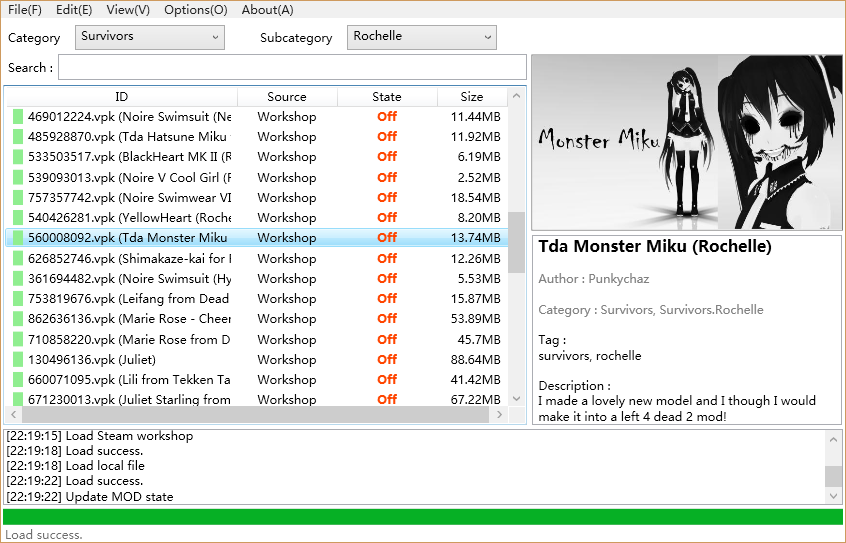
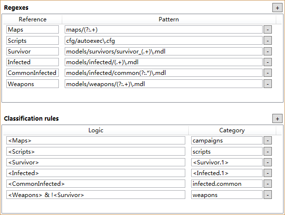
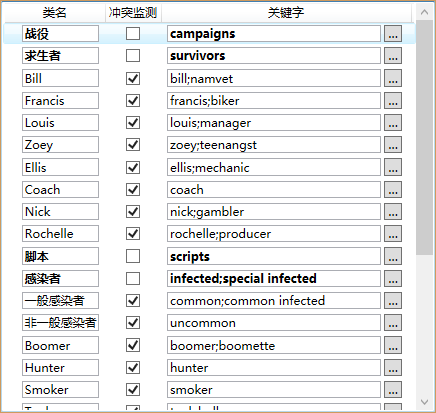
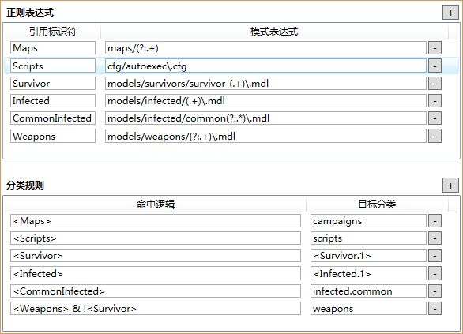

# L4D2ModManager
A mod manager for the game _Left 4 dead 2_

[中文版说明](#中文版说明)

## What's this
I feel tired and difficult to manage all my subscribed workshop items, the conflicts among MODs provided by the game are not reliable, what's more? they didn't give me some options to category my MODs.
Then I created this to help me deal with my subscribed MODs.

So as you think, this guy I made is used to manager game MODs, find out it there some conflicts, and have an easier way to figure out conflicts.

The screenshot of the software is just like below :

**Notice : If you are attending to manage your subscribed MODs, I recommend you use it after you launch your game and check whether there are some downloads or updates, beacause download/update of MODs will set them On automatically. Maybe I will solve this problem by adding download & updating function to this software.**

## Features
- Read subscribed items' information from Steam workshop (logined Steam is required)
- Try read information from Steam workshop for local MOD files (players may move their subscribed items to custom MOD directory)
- Read local VPK (MOD) files
- Classify MODs by tags
- Classify MODs by VPK files
- Custom category and classification rules
- Custom UI
- Detect conflicts by categories
- Set On/Off or Subscribe/Unsubscribe without launching game

## Unsupported Features
- Download/Update MODs without launching game
- Classify MODs manually

## Download
Here is the ZIP file link : [Download](https://github.com/xavier-cai/L4D2ModManager/raw/master/Release/Release.zip)

## How to classify MODs by custom rules
This tool allows you to create your own classification rules about file/directory information of VPK file.

### Custom category
The UI is displayed below:

The name property is just for display.

The keywords property is using in classification and tag matching, separate keywords by `';'`, for example, both `zoey` and `teenangst` mean Zoey in this game.

### Custom classification rule
The UI is displayed below:

**Introduction**

The first part is regexes, you can define regexes here to match file/directory name when reading VPK file, and each regex has a reference name which will be used in the second part. Be careful, the regex is required to match the full file name or directory path.

The second part is classification rules, using results of regexes to classify MODs. Logic property shows how to judge a MOD whether or not belong to a specific category.

**Expression**

In logic property, using `<ReferenceName>` to present the result value (success/failed) of regex which named `ReferenceName`, using `&` `|` and '!'  to present logical operation, using `()` to change operation order. And, you can use `<RuleIndex>` (e.g.`<1>`) to present a logic result above.

In category property, you need to give a keyword of the target category, if different categories sharing the same keyword, you can use operation dot (`.`) to specialize the target category. The first usage is using category level: `1` means category while `2` means subcategory, so you can use `1.survivors` or `2.zoey`; The second usage is using the relationship between parent and child, such as `survivors.zoey`. What's more? You can use captures in regexes to replace strings here, the format is `<ReferenceName.CaptureIndex>`.

**Example**

Here is an example, the MODs that contains a model file of survivors are belong to the survivors category, so we created a regex which named `Survivor` to match the model files in VPK file, at the same time, we can capture the survivor's name which contained in the file name, then the expression `<Survivor>` in logic property means match result of the regex `Survivor`, if successful, the MOD will be classified to the survivor's category which is present by a capture expression `<Survivor.1>`.

## How to costom UI
You can add column in list view and custom information displayed in information box. But you only can do it by modify the configure file in JSON format.
- Add column : `view-list.ini`
- Modify information box : `list-box.ini`

Both of them are write in the format below :

`[{1},{2},{3},...]`

Each `{}` contains an element which is required at least two value : `Header` and `Reflection`, `Header` is whatever you like, `Reflection` is the key of content, all valid keys are displayed below:
- FileName
- FileSize
- PublishedId
- Category
- Title
- Author
- Description
- Tags
- ImageURL
- Version
- URL
- OwnerId
- Score

So, you can write your `view-list.ini` just like this : 

`[{"Header":"Local File Name","Reflection":"FileName"},{"Header":"Owner Steam ID","Reflection":"OwnerId"}]`
 
 and then you will have two new columns in your view list.

## Development environment
- .NET 4.5.2
- Visual Studio Community 2017 (C# 5.0)
- WPF (Windows Presentation Foundation)

## Library and packages
- Newtonsoft.Json (you can find dll file in this project)
- Windows API Code Pack (install it : input the command `Install-Package WindowsAPICodePack-Shell` in the `Package Manager Console` )

## Acknowledgement
Thanks for these excellent works, you guys really help me a lot!
- [Facepunch/Steamworks](https://github.com/Facepunch/Facepunch.Steamworks) Steam APIs in C#
- [maddnias/SharpVPK](https://github.com/maddnias/SharpVPK) Read VPK files
- The Mozilla Universal Character Encoding Detector, I get it from [here](https://github.com/lucentsky/UniversalCharsetDetection). But actually, I choosed another C++ fork of it form Notepad++, and made a C# port : https://github.com/xavier-cai/UniversalCharacterSetDetector.

I did some changes in these works for fixing bugs or extend them, you can see the changes in `ForkInfo.txt`.

## License
[MIT](./LICENSE)

Do whatever you want!

## Contact me
cxw39@foxmail.com

****

### 中文版说明
# 求生之路2 MOD管理器
## 这是什么？
管理游戏创意工坊的内容太不方便了，在游戏里有些冲突的MOD不会被标注出来，MOD也不能很好地分类展示。所以就有了这玩意。

软件截图：

**注意：如果你需要用这个软件来管理从创意工坊订阅的MOD，在使用软件之前，我建议你先登陆游戏并检查已订阅MOD的下载和更新，因为下载和更新操作会导致MOD被自动开启，也许我可以通过给这个软件加上下载/更新MOD的功能来解决这个问题**

## 功能
- 从Steam创意工坊读取订阅物品信息(需要在已登陆的Steam)
- 为本地MOD读取Steam创意工坊的信息(玩家有时会把订阅的物品移动到自定义MOD文件夹)
- 从本地文件读取VPK(MOD)文件
- 将MOD按标签分类
- 将MOD按VPK文件包含内容分类
- 自定义分类和分类方案
- 自定义部分界面
- 按分类检测MOD冲突
- 在软件内完成设置MOD的开启/关闭、以及订阅/取消订阅等操作

## 未完成的功能
- 在软件内完成MOD的下载/更新等操作
- 手动分类

## 下载方式
压缩包下载链接：[下载](https://github.com/xavier-cai/L4D2ModManager/raw/master/Release/Release.zip)

## 如何自定义分类和分类方案
这个工具允许你创建分类和用于在读取VPK文件时使用的分类规则

(附：中文版的分类配置文件[下载](https://github.com/xavier-cai/L4D2ModManager/raw/master/Introduction/simple-chinese/patch/patch.zip)，可能容易看懂一点)

### 自定义分类
界面如下：

类名属性仅用于显示.

关键字属性用于分类和标签匹配, 关键字之间使用英文分号(`;`)隔开, 关键字示例,：`zoey`和`teenangst`在游戏里都用于描述Zoey。

### 自定义分类规则
界面如下:

**功能**

第一部分是正则表达式，在这定义用于匹配VPK文件中文件名或目录的正则表达式，每个正则表达式都需要一个后续会用到的引用标识符(给它起个名~)。 需要注意的是，正则表达式需要能匹配完整的文件或目录路径才行。

第二部分是分类规则，使用正则表达式的匹配结果来分类。命中逻辑属性用于判断MOD是否属于某个特定的分类。

**表达式**

在命中逻辑属性中, 用 `<ReferenceName>` 来表示引用表示符为`ReferenceName`的正则表达式的匹配结果(成功/失败)，使用 `&`、`|` 和 '!'与或非逻辑运算, 使用括号 `()` 来改变逻辑运算顺序。

在目标分类属性中，需要给定一个目标分类的关键字，如果不同的分类共享相同的关键字，你可以使用点操作符(`.`)来特指你的目标分类。第一种用法是使用分类的级别：`1`意味着主分类，`2`意味着子分类，所以你就能用类似于`1.survivors`或`2.zoey`的表达式; 第二种用法是通过父子关系, 比如`survivors.zoey`。另外，你还能在这里使用正则表达式中捕获的字符串，使用的语法格式为`<ReferenceName.CaptureIndex>`。

**示例**

我们认为如果MOD的VPK文件中包含了求生者的模型文件则其应该属于求生者分类，所以我们先定义了引用标识符为`Survivor`的正则表达式来匹配刚刚说VPK中的模型文件，同时我们还能通过正则表达式捕获包含在文件名中的求生者的名字，然后在命中逻辑中的`<Survivor>`表示正则表达式`Survivor`的匹配结果，如果成功，MOD就会被分类到捕获表达式`<Survivor.1>`对应的求生者分类中。

### 自定义界面
你可以通过编辑JSON格式配置文件的方式来自定义增加列表显示的内容和右侧信息窗显示的内容
- 添加列 : `view-list.ini`
- 编辑信息窗 : `list-box.ini`

基本格式如下 :

`[{1},{2},{3},...]`

每一个大括号 `{}` 都包含一个信息元素，每个信息元素要求至少提供`Header`和`Reflection`两个信息，`Header`是随便起个名字，`Reflection`是一个给定的内容关键字，所有可用的关键字如下：
- FileName ：文件名
- FileSize ：文件大小
- PublishedId ：物品的发布ID
- Category ：软件中分类
- Title ：MOD标题
- Author ：作者
- Description ：描述
- Tags ：Steam标签
- ImageURL ：预览图地址
- Version ：版本号
- URL ：MOD地址
- OwnerId ：发布者ID
- Score ：Steam评分

那打个比方，`view-list.ini`的内容就可以像下面这样： 

`[{"Header":"版本","Reflection":"Version"},{"Header":"评分","Reflection":"Score"}]`
 
然后界面上的列表就会多出两列.

## 开发环境
- .NET 4.5.2
- Visual Studio Community 2017 (C# 5.0)
- WPF (Windows Presentation Foundation)

## 引用/库/程序包
- Newtonsoft.Json (项目文件里包含dll文件)
- Windows API Code Pack (安装方法：在`程序包管理控制台`里面输入命令`Install-Package WindowsAPICodePack-Shell`)

## 使用的其他项目
感谢大佬们的开源项目！
- [Facepunch/Steamworks](https://github.com/Facepunch/Facepunch.Steamworks) Steam APIs in C#
- [maddnias/SharpVPK](https://github.com/maddnias/SharpVPK) 读取VPK文件
- The Mozilla Universal Character Encoding Detector, Mozilla的字符编码检测程序，我从[这里](https://github.com/lucentsky/UniversalCharsetDetection)下载的源码。实际上，我使用的是Notepad++修改的C++的版本，并做了一个C#的接口：https://github.com/xavier-cai/UniversalCharacterSetDetector

这些项目我做了一些改动来修复BUG或者完善了程序, 修改的内容纪录在 `ForkInfo.txt`里面.

## 许可协议
[MIT](./LICENSE)

想干嘛干嘛！

## 联系方式
cxw39@foxmail.com
